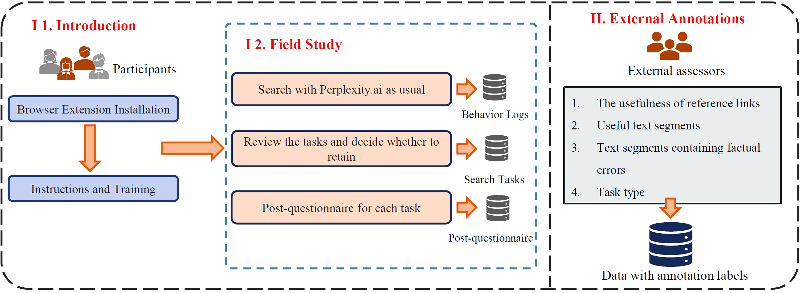
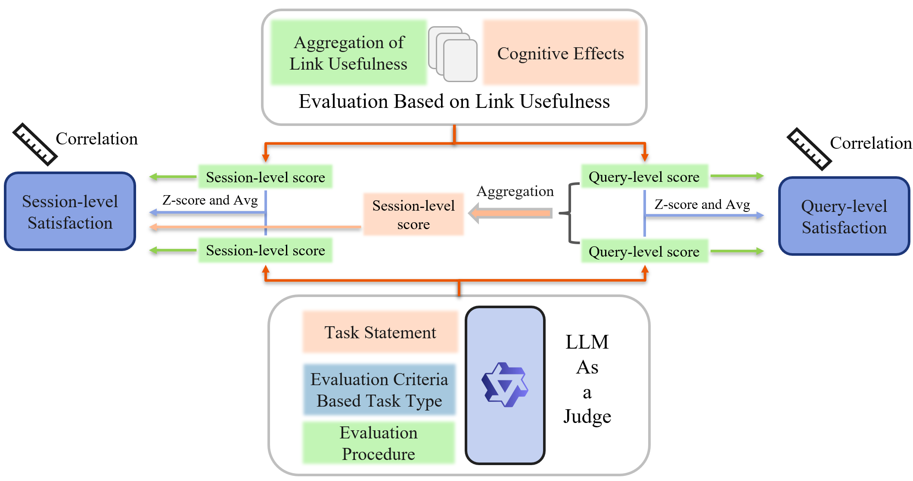

# URGE-Dataset
URGE: A User-Centric Real-World Dataset for Generative IR Systems Evaluation.

Evaluation has long been a central focus in the field of information retrieval (IR). Compared to traditional IR systems, the evaluation of generative IR systems still faces many challenges, especially user-centric evaluation:
- **Absence of unified evaluation standards**  
Traditional IR evaluation typically employs user satisfaction as the ground truth, where assessment scores are measured against this standard through correlation analysis, enabling stronger comparability across different evaluation methods. However, generative retrieval systems lack such a unified ground truth, leading to significantly weaker comparability between evaluation approaches.

- **Synthetic/narrow data bias**  
Current datasets primarily use QA-derived or synthetic data, failing to capture diverse real-world tasks and complex information needs.

- **Lack of multi-turn interaction data**  
Most datasets focus on single-turn query-response pairs, while real-world generative IR systems require session-level evaluation of conversational search processes.

One key issue is the lack of real-world user interaction data and feedback for generative IR systems. Existing evaluation methods for generative IR systems are primarily system-centric, tested on synthetic datasets or those modified from question-answering corpora, which fail to reflect the actual needs of users in real-world scenarios and lack user feedback. To address these issues, we introduce **URGE**, a **U**ser-centric **R**eal-world dataset for **G**enerative IR systems **E**valuation. We conducted a field study in which we collected 562 search sessions that included 1,287 queries on the generative IR system. We collected user behavior (e.g., clicks and query reformulations) and explicit feedback (e.g., query-level and session-level satisfaction). Additionally, expert annotators were recruited for external annotation (e.g., fine-grained usefulness of links). We also introduce an evaluation framework at the query and session level. This dataset provides valuable insights into users' information needs with generative IR systems in real-world scenarios and supports the design of user-centric evaluation metrics.

## 🗄️ Dataset



To collect interaction data and explicit feedback from users engaging with the generative IR system in real-life scenarios, we
conducted a field study on Perplexity.ai.
We collected a total of 562 search sessions, 1287 queries and responses, along with explicit feedback from users at both query and session levels.
In addition, we employed expert annotators to provide external annotations on the data (e.g., the fine-grained usefulness of citation links, useful text segments).
We selected 3 sessions from each of the six task categories, totaling 18 sessions, which are available at here. The complete dataset and code will be made public after the paper is published.

### 📁 Dataset File `sampled_data.csv`

Each row in the CSV file is a search session.

<!-- <style>
.md-table td {
  vertical-align: middle !important;
}
.desc-cell {
  font-size: 0.95em;
  line-height: 1.6;
  padding: 8px 0;
}
</style> -->

<!-- | Attribute Name                | Type            | Description |
|-------------------------------|-----------------|-------------|
| **conversation**              | `JSON`          | - Multi-turn conversation structure <br>- The conversation data is stored in a two-layer JSON format<br> ```json{<br>  "turn_1": {<br>    "user": User's first round query,<br>    "GenIR": System's first round response<br>  },<br>  "turn_2": {<br>    "user": User's second round query,<br>    "GenIR": System's second round response<br>  }<br>}``` |
| **search_intent**             | `string`        | - The search intent provided by the user (open-ended question). |
| **task_type**                 | `string`        | - Task based on search intent<br>- *Six categories*: `"Factual QA"`, `"Solving Professional Problems"`,`"Text Assistant"`,`"Ask for Advice"`,`"Seek Creativity"`,`"Leisure"` |
| **session_level_satisfaction**| `int`           | - Session-level satisfaction (1-5 Likert scale) provided by the user<br>- (1) unsatisfied - (5) very satisfied |
| **query_level_satisfaction**  | `list[int]`     | - Query-level satisfaction (1-5 Likert scale) provided by the user<br>- (1) unsatisfied - (5) very satisfied<br> - *Format*: `[3, 4, 5]` (Corresponding to each query) |
| **link_usefulness**           | `list[JSON]`    | - Link usefulness annotation<br>```json<br>[<br>  {<br>    "1"(url_id_in_response): "2"(usefulness score)<br>  }<br>]``` <br>The index position of each element in the list directly corresponds to the sequential order of queries, i.e., the n-th element represents the usefulness scores in the n-th response.|
| **useful_text_user_self**     | `JSON`          | - Useful text spans provided by the user<br>```json{<br>  "1"(turn_id): {<br>    "0"(useful text span Number): useful text 0,<br>    "1"(useful text span Number): useful text 1,<br>  },<br>  "2"(turn_id): {<br>    "0"(useful text span Number): useful text 0,<br>    "1"(useful text span Number): useful text 1,<br>  }<br>}``` |
| **useful_text_external_annotation** | `JSON` | - Useful text spans provided by the annotators<br> - *Structure*: Same as `useful_text_user_self` |
| **dis_sat_reason**            | `JSON`          | - Dissatisfaction reasons provided by the user (partial collection, a total of 166 tasks)<br>- Multiple choice + open-ended question<br> - Multiple choice: 0 (Satisfied with the content), 1 (Not satisfied with the provided links), 2 (There are errors in the reply content), 3 (The reply content is not comprehensive enough), 4 (Language quality), 5 (Misunderstand the intent), 6 (Not authoritative), 7 (Lack timeliness),  <br>  ```json<br>{<br>  "choices": ['2','3'](user selection), "additional": open-end answer<br>}``` |
| **response_html**             | `list[HTML]`          | - HTML of response<br>| -->

<table>
  <tr>
    <th>Attribute Name</th>
    <th>Type</th>
    <th>Description</th>
  </tr>
  <tr>
    <td><b>conversation</b></td>
    <td><code>JSON</code></td>
    <td>
      - Multi-turn conversation (text content of search session form HTML) <br>
      - The conversation data is stored in a two-layer JSON format<br>
      - Example:
      <pre><code>
{
  "turn_1": {
    "user": User's first round query,
    "GenIR": System's first round response
  },
  "turn_2": {
    "user": User's second round query,
    "GenIR": System's second round response
  }
}
      </code></pre>
    </td>
  </tr>
  <tr>
    <td><b>search_intent</b></td>
    <td><code>string</code></td>
    <td>
      - The search intent provided by the user (open-ended question).
    </td>
  </tr>
  <tr>
    <td><b>task_type</b></td>
    <td><code>string</code></td>
    <td>
      - Task based on search intent<br>
      - Six categories: <code>"Factual QA"</code>, <code>"Solving Professional Problems"</code>,<code>"Text Assistant"</code>,<code>"Ask for Advice"</code>,<code>"Seek Creativity"</code>,<code>"Leisure"</code>
    </td>
  </tr>
  <tr>
    <td><b>session_level_satisfaction</b></td>
    <td><code>int</code></td>
    <td>
      - Session-level satisfaction (1-5 Likert scale) provided by the user<br>
      - (1) unsatisfied - (5) very satisfied
    </td>
  </tr>
  <tr>
    <td><b>query_level_satisfaction</b></td>
    <td><code>list[int]</code></td>
    <td>
      - Query-level satisfaction (1-5 Likert scale) provided by the user<br>
      - (1) unsatisfied - (5) very satisfied<br>
      - Format: <code>[3, 4, 5]</code> (Corresponding to each query)
    </td>
  </tr>
  <tr>
    <td><b>link_usefulness</b></td>
    <td><code>list[JSON]</code></td>
    <td>
      - Link usefulness annotation<br>
      - (0) useless - (3) highly useful <br>
      - Example:
      <pre><code>
[
  {
    "1"(url_id_in_response): "2"(usefulness score),
    "2"(url_id_in_response): "1"(usefulness score),
    "3"(url_id_in_response): "3"(usefulness score)
  },
  {
    "1"(url_id_in_response): "0"(usefulness score),
    "2"(url_id_in_response): "2"(usefulness score)
  }
]
      </code></pre>
      <br>The index position of each element in the list directly corresponds to the sequential order of queries, i.e., the n-th element represents the usefulness scores in the n-th response.
    </td>
  </tr>
  <tr>
    <td><b>useful_text_user_self</b></td>
    <td><code>JSON</code></td>
    <td>
      - Useful text spans provided by the user<br>
      - Example:
      <pre><code>
{
  "1"(turn_id): {
    "0"(useful text span Number): useful text 0,
    "1"(useful text span Number): useful text 1
  },
  "2"(turn_id): {
    "0"(useful text span Number): useful text 0
  }
}
      </code></pre>
    </td>
  </tr>
  <tr>
    <td><b>useful_text_external_annotation</b></td>
    <td><code>JSON</code></td>
    <td>
      - Useful text spans provided by the annotators<br>
      - Structure: Same as <code>useful_text_user_self</code>
    </td>
  </tr>
  <tr>
    <td><b>dis_sat_reason</b></td>
    <td><code>JSON</code></td>
    <td>
      - Dissatisfaction reasons provided by the user (partial collection, a total of 166 tasks)<br>
      - Multiple choice + open-ended question<br>
      - Multiple choice: 0 (Satisfied with the content), 1 (Not satisfied with the provided links), 2 (There are errors in the reply content), 3 (The reply content is not comprehensive enough), 4 (Language quality), 5 (Misunderstand the intent), 6 (Not authoritative), 7 (Lack timeliness)<br>
      - Example:
      <pre><code>
{
  "choices": ['2','3'](user selection), "additional": open-end answer
}
      </code></pre>
    </td>
  </tr>
  <tr>
    <td><b>response_html</b></td>
    <td><code>list[HTML]</code></td>
    <td>
      - HTML of response<br>
      - Information about response can be obtained through HTML, including text content, URLs of links, links serial numbers, and positions where links appear, etc.
    </td>
  </tr>
</table>

## 🧪 Evaluation Framework



### 📁 Code

```bash
EvalCode/
├── prompt_template.py   # 📝 Prompt templates for LLM-as-judge
├── LLM_prompt.py        # 🤖 Generation-based evaluation for scoring with LLM-as-judge method
└── eval.py              # 📊 Eval-pipeline: Link relevance-beased evaluation/Combines LLM-as-judge scoring with relevance metrics/Satisfaction correlation analysis
